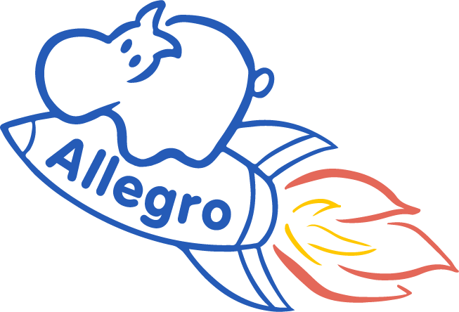

<p align="center">
 
</p>

<br/>

[](https://allegro.readthedocs.io/en/latest/?badge=latest)
[](https://pypi.python.org/pypi/nequip-allegro/)


# Allegro

This package implements the [Allegro E(3)-equivariant machine learning interatomic potential](https://www.nature.com/articles/s41467-023-36329-y).

In particular, `allegro` implements the Allegro model as an **extension package** for the [NequIP framework](https://github.com/mir-group/nequip).

 - [Installation](#installation)
 - [Usage](#usage)
 - [LAMMPS Integration](#lammps-integration)
 - [References & citing](#references--citing)
 - [Community, contact, questions, and contributing](#community-contact-questions-and-contributing)

> [!IMPORTANT]
> A [major backwards-incompatible update](https://nequip.readthedocs.io/en/latest/guide/upgrading.html) to the `nequip` framework was released on April 23rd 2025 as version v0.7.0. The corresponding `allegro` version is v0.4.0. Previous versions of Allegro remain available if needed in the GitHub Releases and must be used with older versions of `nequip`.

## Installation

`allegro` requires the `nequip` package. Details on `nequip` and its required PyTorch versions can be found in [the `nequip` docs](https://nequip.readthedocs.io).

`allegro` can be installed from PyPI (note that it is known as `nequip-allegro` on PyPI):
```bash
pip install nequip-allegro
```
Installing `allegro` in this way will also install the `nequip` package from PyPI.

## Usage

The `allegro` package provides the Allegro model for use within the [NequIP framework](https://github.com/mir-group/nequip).
[The framework's documentation](https://nequip.readthedocs.io) describes how  to train, test, and use models.
A minimal example of a config file for training an Allegro model is provided at [`configs/tutorial.yaml`](configs/tutorial.yaml) and further details can be found in the [Allegro docs](https://nequip.readthedocs.io/projects/allegro/en/latest/).


## LAMMPS Integration

We offer a LAMMPS plugin [`pair_allegro`](https://github.com/mir-group/pair_nequip_allegro) to use Allegro models in LAMMPS simulations, including support for Kokkos acceleration, MPI, and parallel multi-GPU simulations.


## References & citing

**Any and all use of this software, in whole or in part, should clearly acknowledge and link to this repository.**

If you use this code in your academic work, please cite:

 1. The [Allegro paper](https://www.nature.com/articles/s41467-023-36329-y)
    > Albert Musaelian, Simon Batzner, Anders Johansson, Lixin Sun, Cameron J. Owen, Mordechai Kornbluth, and Boris Kozinsky. <br/>
    > "Learning local equivariant representations for large-scale atomistic dynamics." <br/>
    > Nature Communications 14, no. 1 (2023): 579

 2. The [preprint describing the NequIP software framework and Allegro's performance within it](https://arxiv.org/abs/2504.16068)
    > Chuin Wei Tan, Marc L. Descoteaux, Mit Kotak, Gabriel de Miranda Nascimento, Seán R. Kavanagh, Laura Zichi, Menghang Wang, Aadit Saluja, Yizhong R. Hu, Tess Smidt, Anders Johansson, William C. Witt, Boris Kozinsky, Albert Musaelian. <br/>
    > "High-performance training and inference for deep equivariant interatomic potentials." <br/>
    > https://doi.org/10.48550/arXiv.2504.16068

 3. The [computational scaling paper](https://dl.acm.org/doi/abs/10.1145/3581784.3627041) that discusses optimized LAMMPS MD 
    > Albert Musaelian, Anders Johansson, Simon Batzner, and Boris Kozinsky. <br/>
    > "Scaling the leading accuracy of deep equivariant models to biomolecular simulations of realistic size." <br/>
    > In Proceedings of the International Conference for High Performance Computing, Networking, Storage and Analysis, pp. 1-12. 2023.

And also consider citing:
 
 4. The [original NequIP paper](https://www.nature.com/articles/s41467-022-29939-5)
    > Simon Batzner, Albert Musaelian, Lixin Sun, Mario Geiger, Jonathan P. Mailoa, Mordechai Kornbluth, Nicola Molinari, Tess E. Smidt, and Boris Kozinsky. <br/>
    > "E(3)-equivariant graph neural networks for data-efficient and accurate interatomic potentials." <br/>
    > Nature communications 13, no. 1 (2022): 2453
    
 5. The `e3nn` equivariant neural network package used by NequIP, through its [preprint](https://arxiv.org/abs/2207.09453) and/or [code](https://github.com/e3nn/e3nn)


## Community, contact, questions, and contributing

If you find a bug or have a proposal for a feature, please post it in the [Issues](https://github.com/mir-group/allegro/issues).
If you have a self-contained question or other discussion topic, try our [GitHub Disucssions](https://github.com/mir-group/allegro/discussions).

**If your post is related to the NequIP software framework in general, please post in the issues or discussions on [that repository](https://github.com/mir-group/nequip).** Discussions on this repository should be specific to the `allegro` package and Allegro model.

Active users and interested developers are invited to join us on the NequIP community chat server, which is hosted on the excellent [Zulip](https://zulip.com/) software.
Zulip is organized a little bit differently than chat software like Slack or Discord that you may be familiar with: please review [their introduction](https://zulip.com/help/introduction-to-topics) before posting.
[Fill out the interest form for the NequIP community here](https://forms.gle/mEuonVCHdsgTtLXy7).

If you want to contribute to the code, please read [`CONTRIBUTING.md`](https://github.com/mir-group/nequip/blob/main/docs/dev/contributing.md) from the `nequip` repository; this repository follows the same processes.

We can also be reached by email at allegro-nequip@g.harvard.edu.