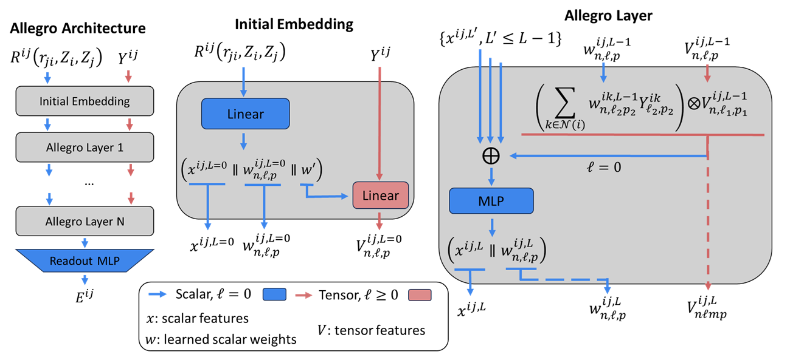

Allegro Model
=============

Allegro hyperparameters
-----------------------
The core hyperparameters of the Allegro model include
 - ``r_max`` is the cutoff radius used for the strictly local Allegro model.
 - ``l_max`` governs the angular resolution of the tensor features. Reasonable ``l_max`` values to try include ``1``, ``2``, and ``3``, where raising ``l_max`` may improve accuracy at the cost of speed. **NOTE** that the computational cost does not increase linearly with ``l_max``, but rather scales polynomially due to the :math:`O(\ell_\text{max}^6)` scaling of the Clebsch-Gordan tensor products. Raising ``l_max`` will also increase the number of tensor paths taken, and the growth of paths is also tied to the choice of ``num_layers``.
 - ``num_layers`` is the number of Allegro layers, which corresponds to the body-ordering (``num_layers=1`` corresponds to three-body tensor features, ``num_layers=2`` corresponds to four-body tensor features, and so on). A Clebsch-Gordan tensor product occurs at each Allegro layer. It is usually appropriate to use 1, 2, or 3 layers.
 - ``num_scalar_features`` and ``num_tensor_features`` correspond to the number of scalar track channels and tensor track channels repsectively. They are separate parameters to set in the Allegro model because of its two-track system. It is often useful to keep ``num_tensor_features`` small and try to raise ``num_scalar_features`` to improve the learning capacity of the model. For ``num_scalar_features``, 16, 32, 64, 128, 256 are good options to try depending on the dataset. For ``num_tensor_features``, 8, 16, 32, 64 are good options to try depending on the dataset.
 - Each Allegro layer contains a neural network or multilayer perceptron (MLP). These are governed by the ``allegro_mlp`` parameters. ``allegro_mlp_hidden_layers_depth`` is the depth and is defaulted to ``1``. One could try reducing it to ``0`` (making the MLP a linear layer), or raising it to ``2`` or ``3`` (it is unhelpful to go beyond ``3``). ``allegro_mlp_hidden_layers_width`` is the width and can be defaulted to a value that is a multiple of 16 or 32 (for performance) and larger than ``num_scalar_features`` (maybe 2 to 4 times as large to start). ``allegro_mlp_nonlinearity`` is ``silu`` by default (which is recommended).

The above core hyperparameters are the most important to set correctly for most use cases. The following are some advanced hyperparameters that can be tuned, but is discouraged unless one is comfortable with the process of hyperparameter tuning.
 - ``parity_setting`` determines whether to use the full set of allowed irreps (i.e. the default behavior of ``o3_full``), or to use a set restricted to spherical harmonic irreps (the ``o3_restricted`` option).
 - ``tp_path_channel_coupling`` determines whether the tensor product weights couple paths and channels or not. The default of ``true`` is expected to be more expressive.
 - After all the Allegro layers comes the readout MLP to energy predictions. These are governed by the ``readout_mlp`` parameters. The following default behavior is recommended as a starting point, but can be tuned as desired. ``readout_mlp_hidden_layers_depth`` is defaulted to ``1``. ``readout_mlp_hidden_layers_width`` can be defaulted to ``num_scalar_features``. ``readout_mlp_nonlinearity`` is defaulted to ``silu``.

API
---

.. autofunction:: allegro.model.AllegroModel

.. autofunction:: allegro.nn.TwoBodyBesselScalarEmbed

.. autoclass:: allegro.nn.TwoBodySplineScalarEmbed